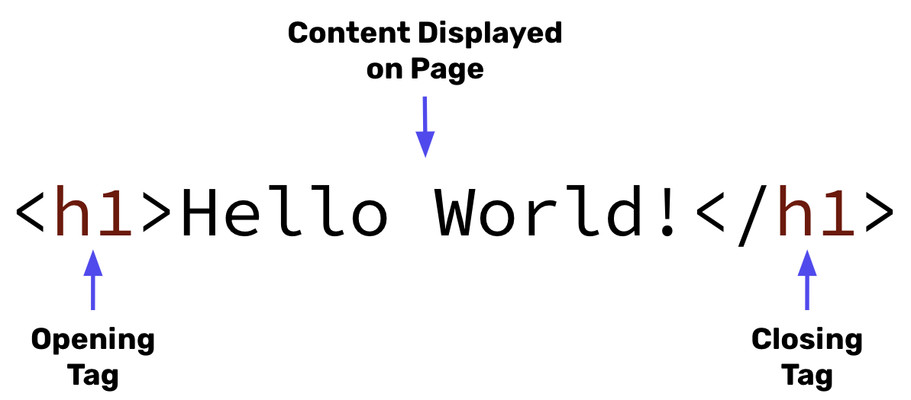

# HTML Essentials
- HTML is the the standard markup language for documents designed to be displayed in a web browser.
- Content to be displayed on the page are enclosed inside of HTML tags. Most tags are comprised of an opening and closing tag with the content going between the two tags.



- The HTML Boilerplate code contains the key tags that are required when structuring an HTML document. The tags in the HTML Boilerplate are `<!DOCTYPE>`, `<html>`, `<head>`, and `<body>`.

## HTML Example

Consider the following HTML code:

```html
<!DOCTYPE html>
<html>
  <head>

    <!-- This is an HTML comment -->
    <title>My First Webpage!</title>

  </head>
  <body>
    <h1 id = "titleText">This is the largest text on the page</h1>
    <p>This is paragraph text on the page</h1>

    <ol>
        <li class = "ordered-list">List item number 1</li>
        <li class = "ordered-list">List item number 2</li>
        <li class = "ordered-list">List item number 3</li>
    </ol>

  </body>
</html>
```

This will render as:


The following elements are part of the HTML Boilerplate:
- `<!DOCTYPE html>`: The very first line of any HTML file. This allows the file to be understood as an HTML file by other technologies.
- `<html>` Tag: Structures the document as an HTML object. Everything on the file goes between the opening and closing `<html>` tags
- `<head>` Tag: Contains all metadata and links. Information here is ***not*** displayed on the page
- `<body>` Tag: Contains all the contents of an HTML document that will be displayed on the page. All information shown on the page goes between these tags.

The following are HTML attributes and provide additional information about HTML elements:
- `id`: Specifies a unique if for an HTML element.
- `class`: Allows us to group together multiple HTML elements.

## #checkoutTheDocs 🔍
- **W3Schools**: [HTML Tag List](https://www.w3schools.com/tags/default.asp)

## Video Resources 🎥
- [HTML Tutorial](https://www.youtube.com/watch?v=PlxWf493en4)