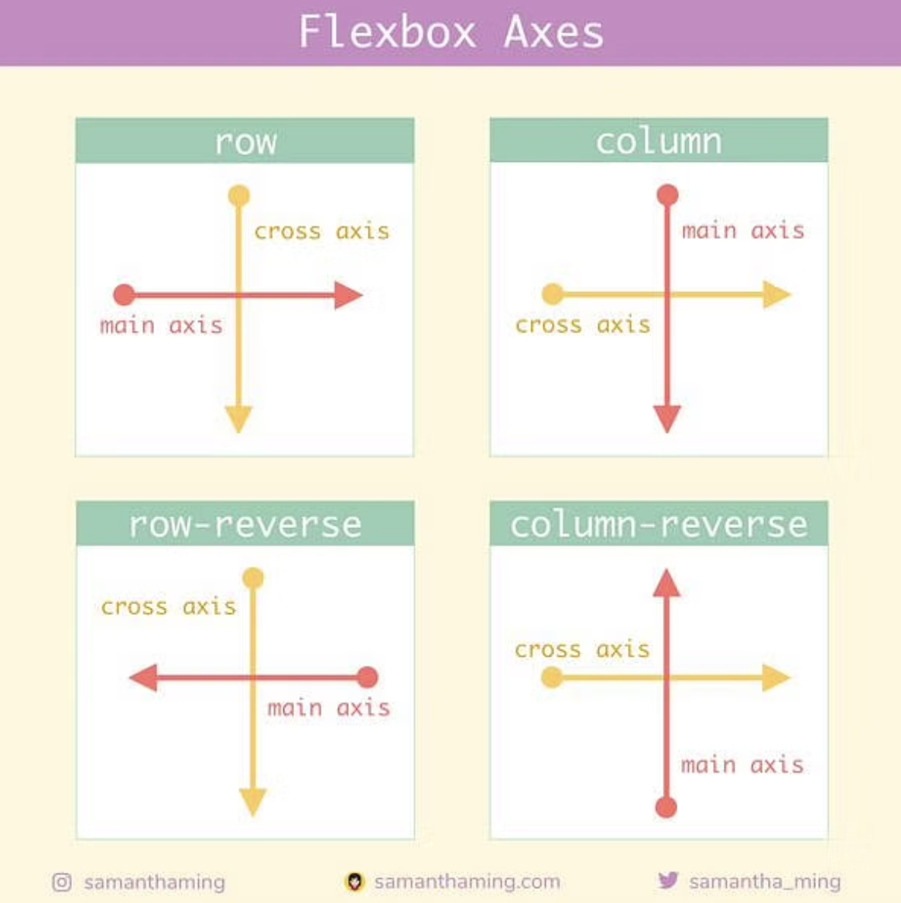

# Flexbox

- The Flexible Box Layout Module (aka flexbox), makes it easier to design flexible responsive layout structure without using `float` or `position` CSS properties that often lead to non-responsive layout.
- A flexbox is created by using the property/value of `display: flex`.
- There are numerous properties that can be used to style flexboxes and their children elements, but the essential ones are: `flex-direction`, `justify-content`, `align-items`, and `flex-wrap`.
- `flex-direction` sets the main and cross axis. The resulting main and cross axis can be seen in the image below:



## Flexbox Example

>You can [use this CodePen](https://codepen.io/stevenjlance/pen/BaPqQKd) to try this example out yourself!

The following HTML and CSS files are created to initialize a flexbox. 

**`index.html`**
```html
<div class = "container">
    <div class = "flexChild">
        1
    </div>
            
    <div class = "flexChild">
        2
    </div>
</div>
```

**`style.css`**
```css
/* Some additional CSS styling for flexChild not shown*/
.container {
    display: flex;
}
```

This will output the following:


### `flex-direction`

The `flex-direction` sets the main-axis. This defines the direction that flex-items are placed in teh flex container. `flex-direction` can have values of `row`, `row-reverse`, `column`, or `column-reverse`. **`row` is the default value if there is no flex-direction.** For example, if we write the following:

```css
.container {
    display: flex;
    flex-direction: row-reverse;
}
```

The main-axis now goes right to left, so the page will now display:


### `justify-content`

`justify-content` defines the alignment and handles extra free space along the main axis. `justify-content` can have a value of either `flex-start`, `flex-end`, `center`, `space-between`, `space-around`, or `space-evenly`. If no value is set, then the default value of `flex-start` is used. 

```css
.container {
    display: flex;
    flex-direction: row; /* Default value */
    justify-content: space-evenly;
}
```

This will evenly distribute all remaining space evenly between all the flex children which would look like the image below.


### `align-items

`align-items` defines how to handle remaining space along the cross-axis. Think of it as `justify-content`, but for the cross axis. `align-items` can have a value of either `flex-start`, `flex-end`, `center`, `stretch`, or `baseline`. If no value is set, then the default value of `flex-start` is used.

Suppose we have a `flex-direction: column` that outputs the following:


The main-axis is top to bottom and the cross-axis is right to left Thus, if we add `align-items: center;` to the container ruleset, this will place all flex children in the center of the left/right axis.


## #checkoutTheDocs 🔍
- **CSS Tricks**: [A Complete Guide to CSS Flexbox](https://css-tricks.com/snippets/css/a-guide-to-flexbox/)

## Video Resources 🎥
- [What the Flexbox - Free Video Tutorial Course on Flexbox](https://flexbox.io/)